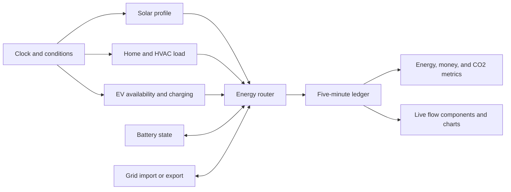

# Los Angeles Home Energy Flow — Design Specification

**Date:** 2026-08-04

**Status:** Approved design, pending specification review

**Product posture:** Product-first residential concept that can also serve as a portfolio case study

## 1. Purpose

Create a believable, replayable month of household energy activity that can drive a modular energy dashboard. The experience should make energy movement understandable at a glance: solar generation, household and appliance demand, EV charging, battery activity, grid imports, grid exports, bill savings, export credit, and avoided carbon emissions.

This specification defines the simulation and accounting contract behind the interface. It does not prescribe a frontend framework or final visual styling.

## 2. Market and scenario

The first scenario represents a detached, owner-occupied home in **Woodland Hills, Los Angeles**, within **LADWP Zone 2**. This market was selected because it combines a large residential solar market, high cooling demand, meaningful time-of-use price differences, EV adoption, and functional net energy metering.

The simulated month is **August 2026**. August is the strongest modeled production month for the selected system and location while also producing an interesting high-use cooling profile.

### Household profile

- Four residents in an approximately 2,200 sq ft detached home
- Central heat-pump HVAC
- Heat-pump water heater
- Induction cooking, refrigerator, laundry, lighting, and normal electronics
- 8 kW rooftop solar array, premium modules, fixed roof mount, 20° tilt, 180° azimuth, 14% modeled losses
- 13.5 kWh usable home battery, 5 kW maximum charge/discharge power, 90% round-trip efficiency, 15% reserve
- 75 kWh EV with a 7.2 kW Level 2 charger and a 30–40 mile weekday commute
- LADWP residential R-1B time-of-use service

### Reference anchors

- The NLR PVWatts v8 model estimates **1,414.65 kWh AC** for August and **13,581.49 kWh AC** annually for the selected 8 kW system and location.
- The August 2026 LADWP R-1B energy-price snapshot used by the simulation is approximately **$0.35124/kWh High Peak**, **$0.29284/kWh Low Peak**, and **$0.26540/kWh Base**, plus a $12 monthly service charge.
- LADWP net energy metering creates a banked bill credit. The interface must describe this as **export credit earned**, not cash income or money paid out.
- The carbon calculation uses LADWP's 2024 reported factor of **505 lb CO2e/MWh**, equivalent to approximately **0.229 kg CO2e/kWh**.

Rates, program rules, and emissions factors are treated as versioned scenario inputs, not universal constants. They must be revalidated before using the concept for a live customer product.

## 3. Experience goals

The simulation should let a viewer:

1. See where electricity is coming from and where it is going now.
2. Understand how behavior changes over a day and across an August month.
3. Distinguish household consumption from EV consumption.
4. See when the battery charges, discharges, or holds its reserve.
5. See grid buying and selling as separate, mutually exclusive states.
6. Connect physical energy flows to savings, export credit, and avoided emissions.
7. Pause, scrub, or jump through the month without the numbers changing between replays.

The default playback rate is **one simulated day per real minute**. Five-minute records are interpolated for visually smooth transitions while accounting totals remain based on the original records.

## 4. Chosen simulation approach

Use a **data-anchored deterministic hybrid**:

- Anchor monthly solar output to PVWatts and tariff/emissions calculations to published LADWP values.
- Generate believable five-minute solar, demand, EV, and temperature-shaped patterns.
- Add controlled seeded variation for clouds, appliance events, occupancy, weekends, and heat waves.
- Validate the complete month before exposing it to the interface.
- Save or reproduce the same month from a fixed seed so every replay and test is identical.

This provides more realism than a hand-authored loop while remaining stable enough for design work, testing, and demonstrations. It does not claim to reproduce a real customer's meter history or forecast an actual bill.

## 5. System architecture

The design has five layers:

1. **Clock and conditions** — timestamp, weekday/weekend state, temperature profile, cloud factor, occupancy, and event tags.
2. **Producers and loads** — solar production, home demand, and EV charging demand.
3. **Energy router** — applies battery and grid rules while conserving energy.
4. **Immutable interval ledger** — stores the resolved five-minute result and prices.
5. **Derived metrics and presentation** — computes totals and drives component values, charts, and flow animation.



All visible modules read from the same resolved ledger. Components do not calculate independent versions of energy or money totals.

## 6. Time resolution and record contract

August contains **8,928 immutable five-minute records**: 31 days × 24 hours × 12 intervals.

Each interval contains at least:

- Timestamp and local time-of-use period
- Scenario tags such as typical weekday, weekend, heat wave, or cloudy day
- Ambient temperature and solar/cloud multiplier
- Solar production in kW and kWh
- Home demand in kW and kWh
- Home-load breakdown for HVAC, water heating, cooking, laundry, refrigeration, lighting, and electronics/other
- EV charging demand in kW and kWh
- Battery charge and discharge in kW and kWh
- Battery state of charge at the start and end of the interval
- Grid import and export in kW and kWh
- Charge-side loss, discharge-side loss, and total conversion loss in kWh
- Resolved transfers with source, destination, average kW, and kWh for every active connection
- Import price and export-credit rate for the interval
- Interval import cost, export credit, counterfactual cost, savings, and avoided CO2e

Power values describe the interval's average rate. Energy values are the quantities used for accounting. Summary cards aggregate energy values and never sum power values.

### Conservation rule

Every interval must satisfy, within a small numeric tolerance:

```text
solar + battery discharge + grid import
= home + EV + battery charge + grid export + conversion losses
```

In this equation, battery charge is energy added to storage and battery discharge is energy removed from storage. Conversion loss accounts for the difference across the AC/DC boundary. Use equal charge and discharge efficiencies of √0.90 (approximately 94.87%), yielding 90% efficiency for a complete charge/discharge cycle. The battery's stored-energy change must agree with its charge and discharge fields. Battery activity is internal movement and is never counted as household consumption.

The resolved transfers are the canonical source for flow-line animation. Required routes are solar→home, solar→EV, solar→battery, solar→grid, battery→home, battery→EV, grid→home, and grid→EV. Routes with zero energy are omitted or stored as zero consistently.

## 7. Generation model

### Solar

Create a daylight-only bell-shaped power curve from sunrise to sunset. Vary its shape and amplitude using deterministic daily cloud factors, then scale the month so August generation matches the 1,414.65 kWh PVWatts anchor within ±2% without exceeding the 8 kW array rating.

Most days should be clear or lightly variable. Include a few visibly cloudy intervals and at least one reduced-production day so the month does not look mechanically repeated. Solar output is exactly zero at night.

### Home and appliances

Build home demand from additive profiles:

- Always-on baseload
- Morning occupancy and cooking ramp
- Temperature-driven HVAC cycling, strongest on hot afternoons and early evenings
- Water heating, laundry, cooking, and dishwasher events
- Lighting and electronics concentrated in occupied evening hours
- Seeded small variation that is temporally correlated rather than white noise

Target **1,700–1,950 kWh** of August home demand before EV charging. The range represents a deliberately high-use Woodland Hills household and is an acceptance envelope, not a claim about a typical LADWP customer.

### EV

On weekdays, reduce the EV's vehicle state of charge for a seeded 30–40 mile trip using a plausible efficiency range, then make the vehicle available to the home charger primarily from evening through the following morning. Prefer charging after 8:00 p.m.; charge sooner only when needed to meet the next trip's energy requirement.

Weekend availability and trip energy vary, but the EV battery must remain within 0–100% and have enough energy for every scheduled departure. Target **300–420 kWh** of home EV charging for the month. EV charging is included in total household consumption but remains separately visible.

### Scenario variation

The month includes four recognizable day types:

- Typical weekday
- Weekend or home-occupied day
- Heat-wave weekday with longer HVAC cycles
- Cloud-affected day with reduced or irregular solar output

Variation changes amplitudes and event timing while preserving the recognizable daily logic.

## 8. Routing and control rules

Resolve every interval in this order:

1. Solar serves current home and EV demand.
2. Remaining solar charges the home battery, subject to battery capacity, power, and efficiency limits.
3. Remaining solar exports to the grid.
4. If demand exceeds solar, the battery may discharge to serve the shortfall, subject to its reserve and power limits.
5. The grid imports the final unmet demand.

Battery dispatch adds time-aware behavior:

- Preserve the 15% reserve.
- Prefer discharge during the 1:00–4:59 p.m. High Peak period and the 5:00–7:59 p.m. evening demand period.
- Avoid routine overnight discharge so the battery is not emptied into low-price baseload.
- Charge only from solar in version 1.
- Never export battery energy to the grid in version 1.

Grid import and export cannot occur in the same interval. Battery charge and discharge cannot occur in the same interval.

## 9. Expected daily behavior

A typical weekday should read as a coherent story:

- **12:00–6:00 a.m.** — low baseload and scheduled EV charging use the grid; the home battery holds its reserve.
- **6:00–9:00 a.m.** — waking, cooking, hot water, and HVAC raise household demand while solar ramps up.
- **9:00 a.m.–1:00 p.m.** — solar increasingly covers the home, then charges the battery; surplus may export.
- **1:00–5:00 p.m.** — high-price cooling is served by solar and, when useful, the battery; grid demand is reduced.
- **5:00–8:00 p.m.** — solar falls while home demand remains elevated; the battery supplies the evening shortfall.
- **8:00 p.m.–12:00 a.m.** — the grid supplies baseload and usually charges the EV during the Base period.

Not every day follows the same exact transitions. Clouds, heat, weekend occupancy, appliance events, EV arrival, and battery state can shift the visible flows.

## 10. Tariff, money, and carbon accounting

### Time-of-use periods

For the approved August scenario:

- **High Peak:** weekdays, 1:00–4:59 p.m.
- **Low Peak:** weekdays, 10:00 a.m.–12:59 p.m. and 5:00–7:59 p.m.
- **Base:** weekdays, 8:00 p.m.–9:59 a.m., plus all weekend hours

The monthly service charge is shown in bill detail if needed, but it cancels out of the savings comparison because both simulated and counterfactual homes pay it.

### Display metrics

- **Solar produced:** sum of solar generation.
- **Energy consumed:** home demand plus EV charging demand.
- **Grid bought:** sum of grid imports.
- **Grid sent:** sum of grid exports.
- **Export credit earned:** sum of interval grid export × the configured NEM credit rate; label this as a banked bill credit, not cash revenue.
- **Counterfactual cost:** cost of serving the same home and EV interval loads entirely from the grid at the applicable time-of-use price.
- **Simulated net energy cost:** import cost minus export credit.
- **Money saved:** counterfactual cost minus simulated net energy cost.
- **CO2e avoided:** counterfactual grid emissions minus simulated net grid emissions, using 0.229 kg CO2e/kWh for both imported and displaced exported energy.

Taxes, minimum-bill adjustments, demand charges, degradation costs, financing, and equipment payback are outside version 1. The money cards describe this modeled month's energy economics, not a utility bill forecast or investment return.

## 11. Presentation contract

The data layer supports modular components corresponding to the reference designs:

- Solar
- Home, with an optional appliance/HVAC breakdown
- EV
- Battery
- Grid
- Energy consumed and produced
- Money saved
- Export credit earned
- CO2e avoided
- Energy arbitrage/import-export history

Flow lines animate only when their ledger flow is positive. Direction follows source to destination; visual speed or pulse density scales with power. Zero-flow connections remain quiet. During interpolation, the interface may smooth displayed kW and state-of-charge values, but cumulative kWh, money, and carbon totals advance only from validated ledger records.

The viewer can play/pause, scrub to any interval, jump by day, and switch summary aggregation between day, week, and month. Scrubbing reconstructs every card from the selected ledger position, so no component becomes inconsistent with another.

## 12. Validation and tests

The generator must reject the month if any invariant fails.

### Interval invariants

- Energy balances within the chosen floating-point tolerance.
- Battery state of charge remains between 15% and 100%.
- Battery never charges and discharges simultaneously.
- Grid never imports and exports simultaneously.
- Solar is zero outside daylight and never exceeds the array rating.
- EV state remains within its bounds and supports every scheduled trip.
- All energy, cost, credit, savings, and carbon values are finite and use consistent units.

### Month-level acceptance checks

- Exactly 8,928 ordered, unique five-minute records exist.
- Solar generation is within ±2% of the 1,414.65 kWh August anchor.
- Home demand is 1,700–1,950 kWh and EV charging is 300–420 kWh.
- Daily and monthly totals equal the sum of their source intervals.
- The same seed and scenario inputs produce the same dataset.
- The month contains all four required day types and visibly distinct load/solar behavior.

### Test coverage

- Focused tests for the router, battery limits and efficiency, time-of-use classification, NEM credit, savings, and carbon calculations
- Boundary tests at every tariff transition and at battery reserve/full states
- Full-month integration test covering all 8,928 records and all invariants
- Snapshot or fixture test confirming deterministic regeneration from the approved seed

If generation or loading fails validation, playback does not start. The interface retains the last valid state and displays **“Simulation data unavailable.”** It must not show partially calculated or contradictory metrics.

## 13. Scope boundaries

Version 1 includes one synthetic Los Angeles detached-home scenario for August 2026. It excludes:

- Real customer meter ingestion
- Live weather or utility APIs during playback
- Community microgrids and commercial facilities
- Multiple homes or scenario-building controls
- Battery grid charging, battery export, virtual power plant dispatch, or demand response revenue
- Real cash payout claims for exported energy
- Forecasting, equipment sizing recommendations, or financial advice

These exclusions keep the first implementation focused on a trustworthy energy-flow story and reusable UI component contract.

## 14. Success criteria

The design succeeds when:

1. A complete August dataset is deterministic, valid, and internally balanced.
2. A viewer can identify the active source and destination of energy without reading documentation.
3. Battery, grid, EV, and solar behavior looks plausible across normal, hot, weekend, and cloudy days.
4. Every displayed total can be traced to the immutable interval ledger.
5. Savings and exports use accurate language: modeled savings and banked export credit, not guaranteed income.
6. The simulation can replay smoothly at one day per minute and remain consistent after pause, jump, and scrub actions.

## 15. Sources

- [LADWP residential electricity rates](https://www.ladwp.com/account/customer-service/electric-rates/residential-rates)
- [LADWP Net Energy Metering Guidelines](https://webprod.ladwp.com/sites/default/files/documents/LADWP_Amended_Net_Energy_Metering_Guidelines_Document_January_2021_.pdf)
- [LADWP Power Content Label and emissions information](https://www.ladwp.com/who-we-are/power-system/power-content-label)
- [NLR PVWatts v8 API scenario](https://developer.nlr.gov/api/pvwatts/v8.json?api_key=DEMO_KEY&azimuth=180&system_capacity=8&losses=14&array_type=1&module_type=1&tilt=20&lat=34.1683&lon=-118.6059)
